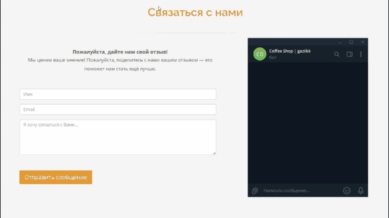

<h1 align="center">CoffeeShop</h1>

<h2 align="center">
    
    
    
    
    
    
</h2>


## Installation

1. Clone this repository: ```git clone https://github.com/gaziikk/CoffeeShop.git ```
2. Install ```virtualenv``` : ```python -m venv venv```
3. Activate ```virtualenv``` : ```venv/scripts/activate```
4. cd into ```coffee_shop```: ```cd coffee_shop```.
5. Install ```packages and modules```: ```pip install -r requirements.txt```
6. Run project: ```python manage.py runserver```

## Telegram send messages
> For the correct operation of the logic of sending messages to telegram, follow these steps

1. Create ```config.py``` file: ```echo > config.py```
2. Fill in the constants with your values
   ```python
   TOKEN='9012340909:HHSDLFK-EXAMPLE-TG-BOT-TOKEN-upritulkjlkfgdm'
   TELEGRAM_ID='YOUR-TELEGRAM-ID'
   ```
    > TOKEN – a token for working with a bot in telegram

    > TELEGRAM_ID – the unique ID in the telegram to which the messages will be sent
    ---
    ### Where can I get a ```TOKEN```?
    + Go to the **telegram**
    + **Search** [Bot Father Bot](https://t.me/BotFather)
    + Create a **new bot**, after the bot creation stage, the bot will send you a **token**
    ---
    ### Where can I get a ```TELEGRAM_ID```?
    + Go to the **telegram**
    + **Search** [Get My ID Bot](https://t.me/getmyid_bot)
    + Write **/start** and get your telegram id

## Short description
A web application designed to optimize the operation of a coffee shop. In the web application, you can add a dish or a chef (for the administrator only). The logic of sending messages in telegrams for feedback is implemented. The template was found on the Internet. The project was created for educational purposes

## Media materials
<p align="center">
    
    
    
</p>
<p align="center">
    
    
    
</p>
<p align="center">
    
    
    
</p>
<p align="center">
    
</p>
